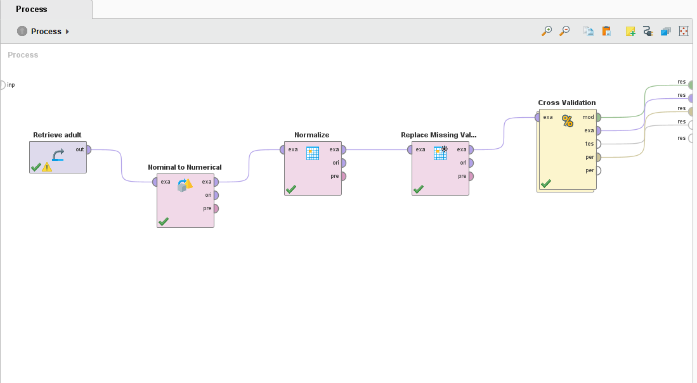
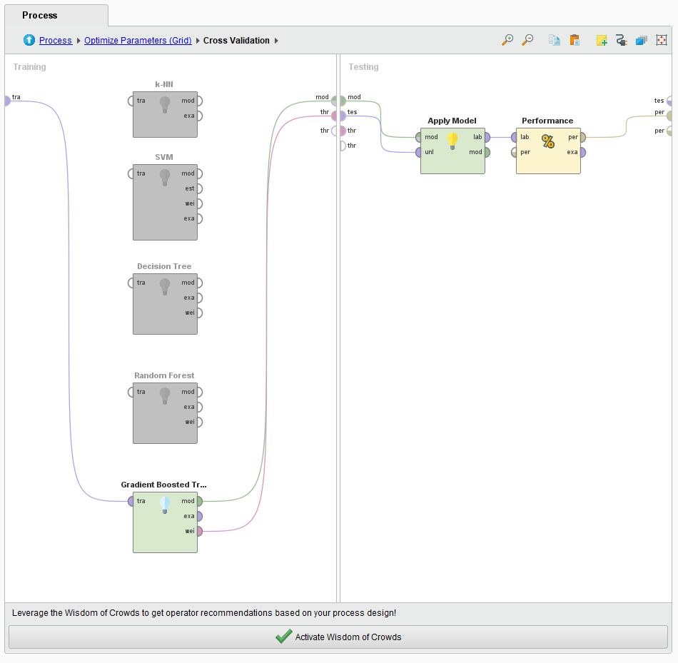
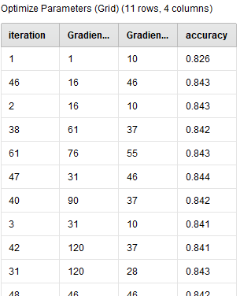

# Homework 4 : Data Classification Assignment.

## Step 1 -  Problem Statement
Can we predict whether income exceeds $50K/yr ?

## Step 2 - Data Collection: 
1994 Census Income data. Extraction was done by Barry Becker from the 1994 Census database. 
https://archive.ics.uci.edu/dataset/2/adult

Number of items in dataset = 32,560

## Step 3 - Data pre-processing: 
In the data pre-processing, there are 4 methods that have been used.
1. **Removal of correlating features**: Removing features that are closely related to each other, the education num and education in text format was pointing to the same thing, so we remove education in text format and use education num.
2. **Nominal to Normalize**: Converting the class data (in textual format) to numerical one so the modelling algorithm can be applied.
3. **Normalize** : Normalizing numerical data which can have huge ranges to small specific range (like -1 to 1 or 0 to 1 etc.), so we can avoid impact of extreme cases and computation is faster.
4. **Replacing Missing Value** : Some of the data rows have missing values, we replace the values using strategy like minimum, zero, average etc.

Pre-processing step in Rapid-Miner:


## Step 4 - Modelling:

Models used:


1. **KNN**
	**Description**: 
	The k-Nearest Neighbor algorithm is based on comparing an unknown Example with the _k_ training Examples which are the nearest neighbors of the unknown Example.
	**pros**: 
	1. **Simplicity:** KNN is easy to understand and implement. It doesn't make any assumptions about the underlying data distribution, making it non-parametric.
	2. **No Training Phase:** KNN is instance-based, which means it doesn't have a training phase. The algorithm memorizes the entire dataset, making it efficient for small to moderately sized datasets.
	**cons**:
		1. **Computational Complexity:** As the size of the dataset grows, the computational cost of KNN can become prohibitive, especially during the prediction phase. The algorithm needs to compute distances between the query point and all training points.
	2. **Sensitivity to Irrelevant Features:** KNN considers all features equally when computing distances. If some features are irrelevant or noisy, they can adversely affect the predictions.
	**Hyperparameter**:
	 - k: number of clusters.
	 - measure types: Type of measures when multiple data types are involved.
	 - mixed measures: Type of distance calculation.

	**PerformanceVector**:  
	accuracy: 82.89% +/- 0.76% (micro average: 82.89%)  
	precision: 66.95% +/- 2.00% (micro average: 66.93%)  
	recall: 57.24% +/- 1.88% (micro average: 57.24%)

	Weighted 5-Nearest Neighbour model for classification.
	The model contains 32560 examples with 92 dimensions of the following classes:
	  <=50K
	  \>50K

2. **SVM**
	The standard SVM takes a set of input data and predicts, for each given input, which of the two possible classes comprises the input, making the SVM a non-probabilistic binary linear classifier.
	**pros**:
	1. **Effective in High-Dimensional Spaces:** SVM performs well in high-dimensional spaces, making it suitable for tasks with a large number of features, such as text classification and bioinformatics.
	2. **Robust to Overfitting:** SVM is effective in high-dimensional spaces even when the number of dimensions is greater than the number of samples. It tends to generalize well, preventing overfitting, especially in high-dimensional spaces.
	**cons**:
	1. **Sensitivity to Noise:** SVM is sensitive to noisy data, as outliers can significantly affect the position and orientation of the optimal hyperplane. Outliers and mislabeled data points can lead to poor performance.
    
	2. **Computational Intensity:** Training an SVM model, especially with large datasets, can be computationally intensive. The time complexity of SVM training is approximately quadratic with the number of samples, making it less suitable for very large datasets.
	**Hyperparameters**:
			- kernel type: dot, radial and polynomial.
			- C val: -1 to $\infty$
			- convergence epsilon: defines precision on KKT conditions.
			- L pos.
			- N pos.

	**PerformanceVector**:  
	accuracy: 84.22% +/- 2.96% (micro average: 84.22%)  
	precision: 73.64% (positive class: >50K)  
	recall: 53.67% +/- 18.94% (micro average: 53.67%)  

3. **Decision Trees**
	A decision tree is a tree like collection of nodes intended to create a decision on values affiliation to a class or an estimate of a numerical target value. Each node represents a splitting rule for one specific Attribute.
	**pros**:
	1. **Interpretability:** Decision Trees are easy to understand and interpret, even for people without a background in data science. They represent decisions and decision-making processes in a clear visual manner.
	2. **No Assumptions about Data:** Decision Trees do not make any assumptions about the underlying data distribution. They can handle both numerical and categorical data without the need for data transformation.
	**cons**:
		1. **Overfitting**: Decision Trees are prone to overfitting, especially when they are deep. A deep tree can memorize the training data, leading to poor generalization on unseen data. Techniques like pruning and setting a maximum depth are used to mitigate overfitting.
	2. **Instability:** Small variations in the data can result in a completely different tree structure. This instability can make the model unreliable, especially with small datasets.
	**Hyperparameters**:
		- criterion: decides selection of attributes for splitting.
		- maximal depth: depth of the tree.
		- confidence: used for error calculation.
		- minimal gain.
		- minimal leaf size. 
	
	**PerformanceVector**:  
	accuracy: 85.41% +/- 0.39% (micro average: 85.41%)  
	precision: 77.49% +/- 0.96% (micro average: 77.47%)  
	recall: 55.55% +/- 2.28% (micro average: 55.55%)   

4. Random forest
	A random forest is an ensemble of a certain number of random trees, specified by the _number of trees_ parameter. These trees are created/trained on bootstrapped sub-sets of the ExampleSet provided at the Input Port. Each node of a tree represents a splitting rule for one specific Attribute.
	**pros**:
	1. **High Accuracy:** Random Forest generally provides higher accuracy compared to individual Decision Trees. By averaging the predictions of multiple trees, it reduces overfitting and results in a more accurate and stable model.
	2. **Reduced Overfitting:** Random Forest mitigates overfitting by aggregating the predictions of multiple trees. Each tree is built on a random subset of the data and a random subset of features, reducing the chance of overfitting to the training data.
	**cons**:
	1. **Less Interpretability:** While Random Forest can provide feature importance scores, the model as a whole is more difficult to interpret compared to individual Decision Trees. Understanding the reasoning behind a specific prediction can be challenging.
	2. **Computational Complexity:** Random Forest can be computationally intensive, especially when the number of trees in the forest is large. Prediction time can also be relatively slower compared to simpler models like Decision Trees.
	**Hyperparameters**:
	- number of trees
	- criterion
	- maximal depth
	- voting strategy
	
	**PerformanceVector**:  
	accuracy: 83.80% +/- 0.45% (micro average: 83.80%)  
	precision: 90.75% +/- 1.84% (micro average: 90.60%)   
	recall: 36.51% +/- 2.87% (micro average: 36.51%)   

5. Gradient boosting
	A gradient boosted model is an ensemble of either regression or classification tree models. Both are forward-learning ensemble methods that obtain predictive results through gradually improved estimations.
	pros: 
	1. **High Predictive Accuracy:** Gradient Boosting models often provide higher predictive accuracy compared to individual decision trees and other machine learning algorithms. They can capture complex patterns in the data, leading to accurate predictions.
	2. **Handles Mixed Data Types:** Gradient Boosting can handle a mix of feature types, including numerical and categorical variables, without requiring extensive preprocessing. It can also handle missing values in the data.
	cons:
	1. **Prone to Overfitting:** Gradient Boosting models, especially with deep trees, are prone to overfitting, especially when the dataset is small or noisy. Proper regularization techniques, like limiting the tree depth and using learning rate, are necessary to prevent overfitting.
	2. **Computational Complexity:** Training a Gradient Boosting model can be computationally intensive, especially with a large number of weak learners (trees) and complex datasets. Training time can be significantly longer than simpler algorithms like Decision Trees.
	Hyper parameters:
	- number of trees
	- maximal depth
	- number of bins
	- learning rate
	- sample rate
	
	**Performance Vector**:  
	accuracy: 84.10% +/- 0.78% (micro average: 84.10%)  
	precision: 65.67% +/- 1.38% (micro average: 65.67%)   
	recall: 71.19% +/- 2.92% (micro average: 71.19%)

Overall Workflow:


## Step 5 - Hyperparameter Tuning.
- **Decision Tree Hyper-parameter Tuning**:
	parameters tuned: criterion and minimal gain.
	accuracy: 85.59% +/- 0.57% (micro average: 85.59%).
	```
	Decision Tree.criterion	= information_gain
	Decision Tree.minimal_gain	= 0.01
	```

- Gradient Boost Hyper-parameter Tuning:
	parameters tuned: number of trees and number of bins.
	accuracy: 84.82% +/- 0.60% (micro average: 84.82%)
	```
	Gradient Boosted Trees.number_of_trees	= 90
	Gradient Boosted Trees.number_of_bins	= 64
	```

grid representation of tuning done for gradient boost.

## Step 6 - Results:
   
| Models   | Accuracy   | Precision  | Recall |
| -------- | ---------- | ---------- | ------ |
|   KNN    |   82.89%   |   66.95%   | 57.24% |
|   SVM    |   84.22%   |   73.64%   | 53.67% |
|   Decision Trees     |   85.41%   |   77.49%   | 55.55% |
|   Random Forest     |   83.80%   |   90.75%   | 36.51% |
|Gradiant Boost|84.10%|65.67%|71.19%|


From the Tree algorithms, the marital status was the main indicator of determining if the person earned more than 50K dollars.